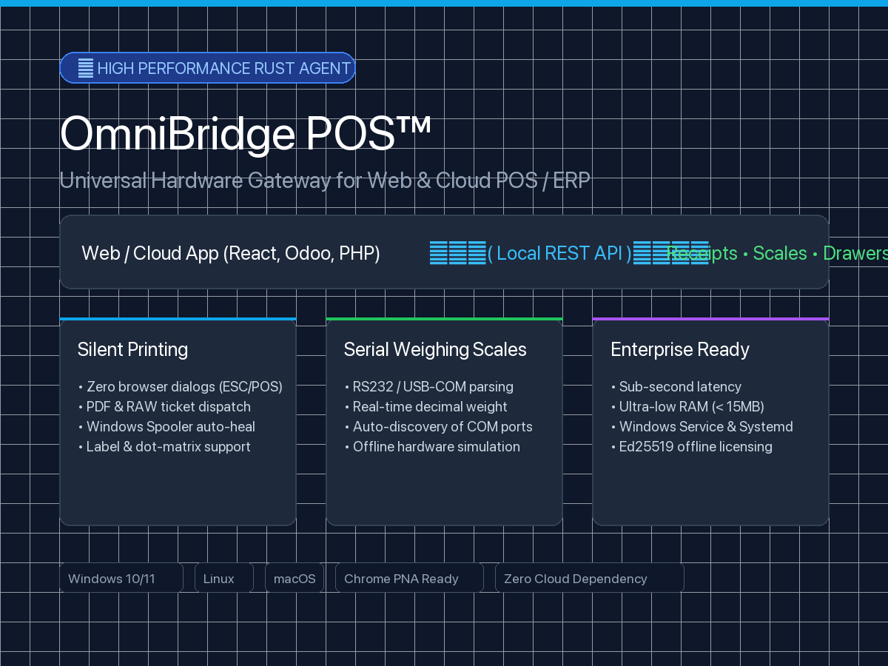

# OmniBridge POS™ — Universal Hardware Gateway (Rust)
### Evaluation DEMO & Integration Documentation

**English** | [Español](README.es.md)

[](https://www.rust-lang.org/)
[]()
[](https://github.com/dpadrino/omnibridge-pos-demo/releases)
[](LICENSE.txt)



---

## 1. What is OmniBridge POS™?

Modern web browsers enforce strict security sandbox policies that prevent direct access to local hardware. As a result:
* Printing thermal receipts forces an intrusive print dialog window (`Ctrl+P`).
* Web applications cannot directly communicate with RS232 / USB-Serial weighing scales.
* Cash drawers connected via RJ11/RJ12 cannot be triggered without OS driver friction.

**OmniBridge POS™** is a high-performance, native background service written in **Rust** that bridges any Web or Cloud POS/ERP (React, Angular, Vue, PHP, Laravel, Odoo, WooCommerce) to physical checkout devices via simple local HTTP REST calls.

---

## 2. ⚡ Quick Download & Evaluation DEMO

You can download the pre-compiled evaluation package directly from the GitHub Releases page:

👉 **[Download Latest Evaluation DEMO (v1.0.0)](https://github.com/dpadrino/omnibridge-pos-demo/releases)**

### Free Evaluation Mode Includes:
* Full access to all REST endpoints on port `8989`.
* Visual Web Diagnostic Dashboard at `http://127.0.0.1:8989/`.
* Serial scale reading (real hardware or simulated mode).
* Silent thermal printing (up to 25 receipts/day with demo watermark).
* Automatic Windows Spooler queue healing.

---

## 3. Integration in 3 Lines of Code (JavaScript)

```javascript
// 1. Read weight in real-time from the serial scale:
const { peso } = await (await fetch('http://localhost:8989/peso')).json();

// 2. Trigger the electric cash drawer kick-out pulse:
await fetch('http://localhost:8989/drawer', { method: 'POST' });

// 3. Print a silent thermal receipt instantly (sub-second):
await fetch('http://localhost:8989/ticket', {
  method: 'POST',
  headers: { 'Content-Type': 'application/json' },
  body: JSON.stringify({ content: "ORDER #101\nTotal: $25.00\nTHANK YOU FOR YOUR PURCHASE\n" })
});
```

---

## 4. Core API Endpoints (Unified Port 8989)

| Method | Endpoint | Description | Payload Format |
| :--- | :--- | :--- | :--- |
| `GET` | `/` | Visual Diagnostic Web Dashboard (1-click test suite) | HTML |
| `GET` | `/peso`, `/weight` | Real-time weight from RS232 / USB serial scale | JSON `{"peso": 1.25, "unit": "kg"}` |
| `POST`| `/ticket` | Intelligent silent thermal receipt printing | JSON, Multipart PDF, or RAW |
| `POST`| `/drawer`, `/gaveta` | Trigger physical cash drawer pulse (RJ11 Pin 2 & 5) | Empty POST |
| `POST`| `/print-label` | Direct RAW barcode label dispatch (TSPL / ZPL) | JSON `{"commands": "..."}` |
| `POST`| `/printers/cleanup` | Auto-purge and recover jammed Windows Print Spooler queues | Empty POST |
| `GET` | `/health`, `/status` | Complete health check across ports, spooler, and license | JSON Health Status |

---

## 5. Commercial Licensing & Pricing

When you are ready to remove evaluation quotas and watermarks, upgrade to a commercial license verified offline via **Ed25519 digital signatures**:

| Plan | Target Audience | Pricing | What's Included |
| :--- | :--- | :--- | :--- |
| **Station / POS License** | Retail stores, supermarkets, pharmacies | **$35 – $50 USD** / yr per POS (or $90 lifetime) | 1-Click Windows Service installer, unlimited receipts and scale readings, zero watermarks, and dashboard access. |
| **OEM / White-Label Partner** | Software houses, Cloud POS / ERP SaaS | **$1,200 – $2,500 USD** (One-time fee) | Unlimited distribution under your own brand name and logo, zero per-seat royalties, full Postman collection, OpenAPI 3.0 spec, and keygen tool. |
| **Custom Engineering** | Bespoke corporate integrations | **Project Quote** | Industrial scale protocols, custom drivers, and assisted integration with Odoo, WooCommerce, or custom backends. |

---

## 6. Official Commercial Brochures (PDF)

* 🇪🇸 [**Download Official Brochure (Español PDF)**](docs/OmniBridge_POS_Brochure_Comercial.es.pdf)
* 🇺🇸 [**Download Official Brochure (English PDF)**](docs/OmniBridge_POS_Brochure_Comercial.en.pdf)

---

## 7. Developer & Sales Contact

For commercial inquiries, license purchases, or custom driver support:

* **Lead Developer:** Darwin Padrino
* **WhatsApp / Phone:** [+58 412-6165227](https://wa.me/584126165227)
* **Email:** [drinowar@gmail.com](mailto:drinowar@gmail.com)
* **Location:** Caracas, Venezuela (Available Worldwide for Remote Integration)
